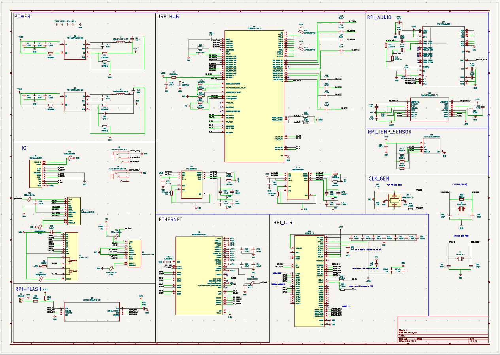
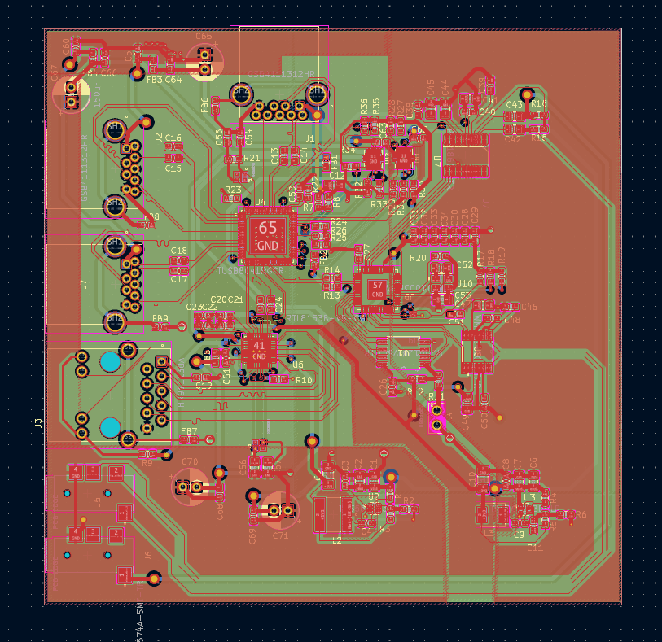

# Usb3.1-Ethernet-RP2040-I2S_HUB_KICAD

- This project relies on Kicad 9.0

## features

### input
- usb 3.1 gen2
### output
- usb 3.0 (2 ports)
- ethernet (1 rj45 port)
- microphone + speaker (stero 3mm jack)
### processor & ic
- Rasberry pi (RP2040)
- tmp235 (temperature sensor)
- tusb8041 (usb hub)
- RTL8153B-VB (ethernet)

### repo structure

```
F---- doc (document for each ICs)
F---- finalProj
           |F---- hub (kicad file)
F---- symFoot (footprint for each ICs)
D---- bom.xlsx (bill of material for all components except pcb board)
```

## preview

### schematic



### layout

